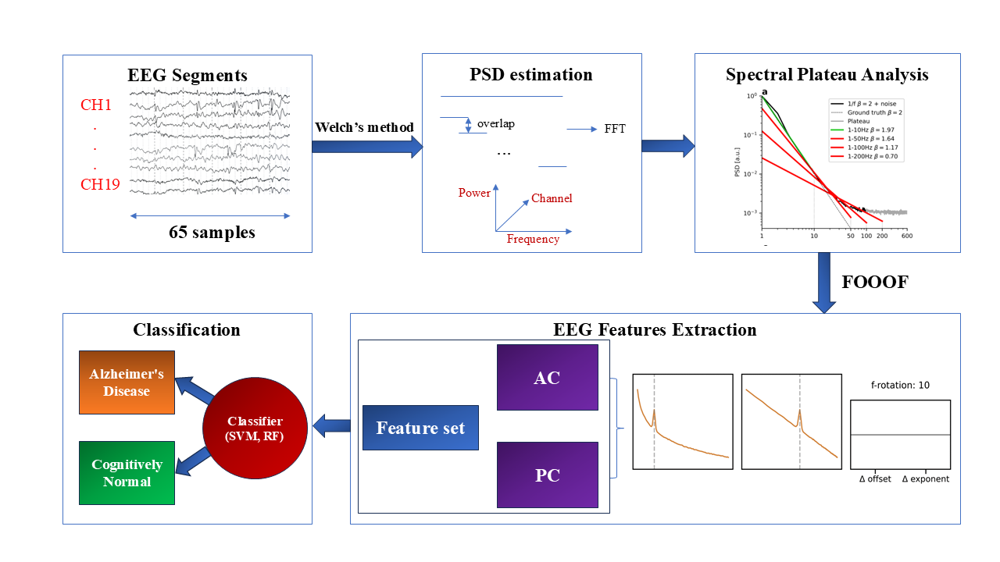

# ThesisUni
[Quang-Duy Tran]( https://github.com/qduytran), [UET-VNU]( https://uet.vnu.edu.vn/)
This repository is where the code for my full-time university graduation thesis is stored, my topic is related to **methods of processing EEG signals**, specifically the analysis of **physiological information** in the frequency domain.

**Improving the Estimation of the 1/f Component in EEG Power Spectrum Parameterization for Alzheimer's Disease Diagnosis** [[``Click this’]]( https://drive.google.com/drive/folders/1A7miuQuSXcl0xZv36eetDHszSRXDuPvf?usp=sharing) 
<p align="center">
  
</p>
<p align="center">
  <strong>Overview</strong>
</p>

## Installation
The code requires `python enviroment`, you need to install `FOOOF` toolbox [here]( https://fooof-tools.github.io/fooof/).
Besides, you need to install libraries such as **mne, scipy** to process EEG signals on the frequency domain.

## Quick Start
This thesis works in the spectral domain. You should calculate the spectral first through power spectrum density estimation method by the file `welch.py`. Using python documents or matlab command `doc pwelch` to check it’s code and tutorials.
Then, using the main function to run workflow followed by **overview** picture:
```
python main.py
```

## Parameter settings


## Results


## Expansion

## Contributors
Quang-Duy Tran (quangduytran812@gmail.com), Nguyen Linh Trung  (linhtrung@vnu.edu.vn), Le Quoc Anh (lqanh@vnu.edu.vn), Signals and Systems Laboratory, FET-UET-VNU.

## Acknowledgements
This work was supported by the members of Signals and Systems Laboratory. Data is taken on open source from [Open Neuron]( https://github.com/OpenNeuroDatasets/ds004504).


